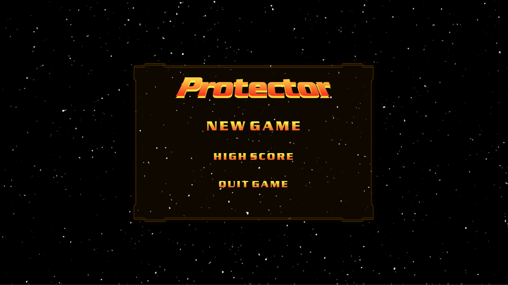
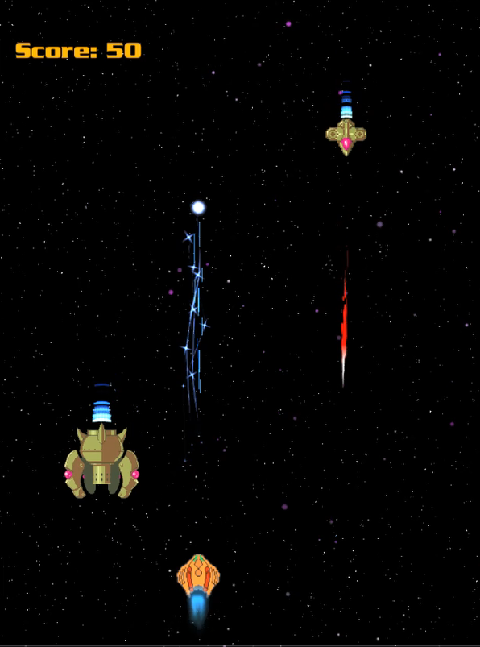

# Space-Shooters
**Thank you for checking out my game!**

This project is base on Unity 2019.3. It is a functional introduction to Space Shooters made in Unity with full source code and assets. Although I don't consider it nearly complete as I expected it to be, but I am continuing my journey in modifying parts and to add new features beyond what it was intended as a base game.

# Screenshots

# Gameplay Features
- Score board that credits you for shooting down enemies 
- Audio that provides background music, and explosion sounds
- Cool Projectile animation
- Player Health Bar

# Controls
